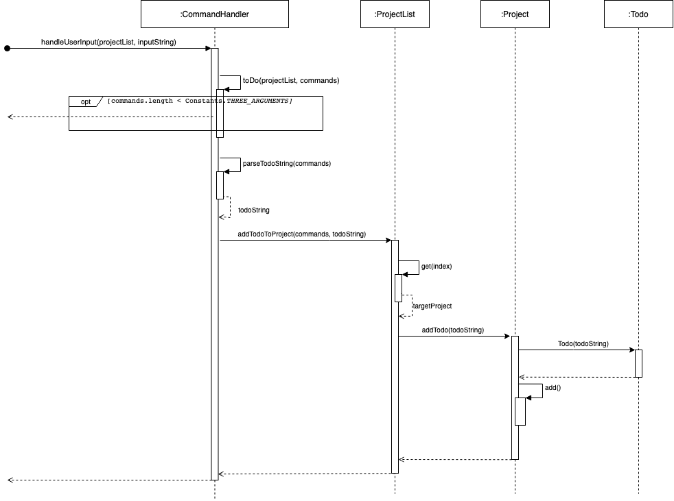

# Developer Guide

## Acknowledgements

{list here sources of all reused/adapted ideas, code, documentation, and third-party libraries -- include links to the original source as well}

## Design & implementation

### Implemented Features

#### Todo feature

**Step1.** When `CommandHandler` receives a user input starting with string “todo”, it will call `toDo()` function to parse the user input into the index of the target `Project` object and one description string.  

**Step2.** If the number of provided arguments is less than the required number, the `toDo()` function will throw an `IllegalCommand` exception and return.  

**Step3.** If no exception is thrown, two strings will be generated by parsing the user input and the `toDo()` function will pass the two arguments to `projectList` for creating and adding a `Todo` object to a `Project` object.  

**Step4.** When `projectList` receives the call, it will get the target `Project` object and pass the description string to it.  

**Step5.** The `Project` object will create a `Todo` object and add it to the `ArrayList<Todo>` in `Project` class.  

### Proposed Features

#### Parse Command Feature

The proposed parse command feature makes use of CommandParser and its subclasses, and Command and its subclasses.  
In the version 1.0 we simply used CommandHandler to parse user input for different commands, which may lead to violation of single responsibility principle. The proposed implementation will implement one command parser for each command (e.g. AddProjectCommand will have a paser named AddProjectCommandParser).  

Given below is an example usage scenario and how the command parser behaves at each step.

**Step 1.** The user inputs command. The command is retrieved by handleUserInput() in CommandHandler.  

**Step 2.** handleUserInput() will check command type and create a new CommandParser object and call parse() in CommandPaser.  

**Step 3.** CommandParser will check if the input can be parsed into a valid command. If it fails, it will throw exceptions. After parsing the user’s input, CommandParser will create a new Command object and return it back to CommandHandler.  

**Step 4.** CommandHandler will call executeCommand() in its own class to execute the returned command.

## Product scope
### Target user profile

{Describe the target user profile}

### Value proposition

{Describe the value proposition: what problem does it solve?}

## User Stories

|Version| As a ... | I want to ... | So that I can ...|
|--------|----------|---------------|------------------|
|v1.0|new user|see usage instructions|refer to them when I forget how to use the application|
|v2.0|user|find a to-do item by name|locate a to-do without having to go through the entire list|

## Non-Functional Requirements

1. Should work on any mainstream OS as long as it has Java 11 or above installed.
2. user with above average typing speed for regular English text (i.e. not code, not system admin commands) should be able to accomplish most of the tasks faster using commands than using the mouse.

## Glossary

* *glossary item* - Definition

## Instructions for manual testing

{Give instructions on how to do a manual product testing e.g., how to load sample data to be used for testing}
