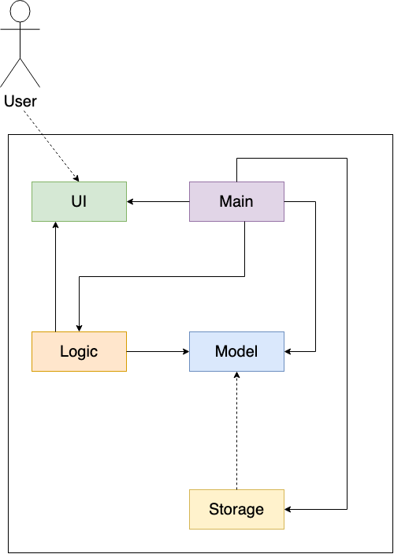
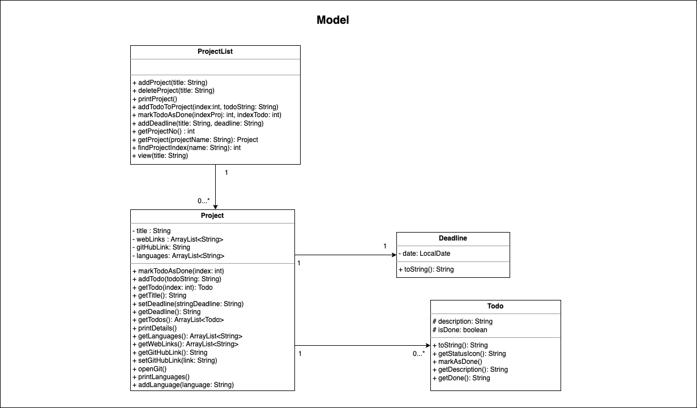
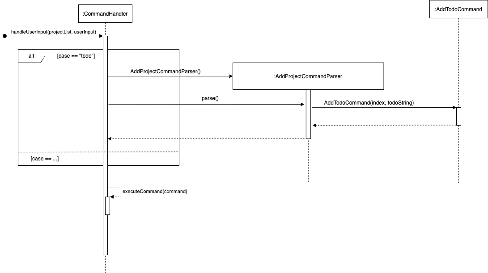
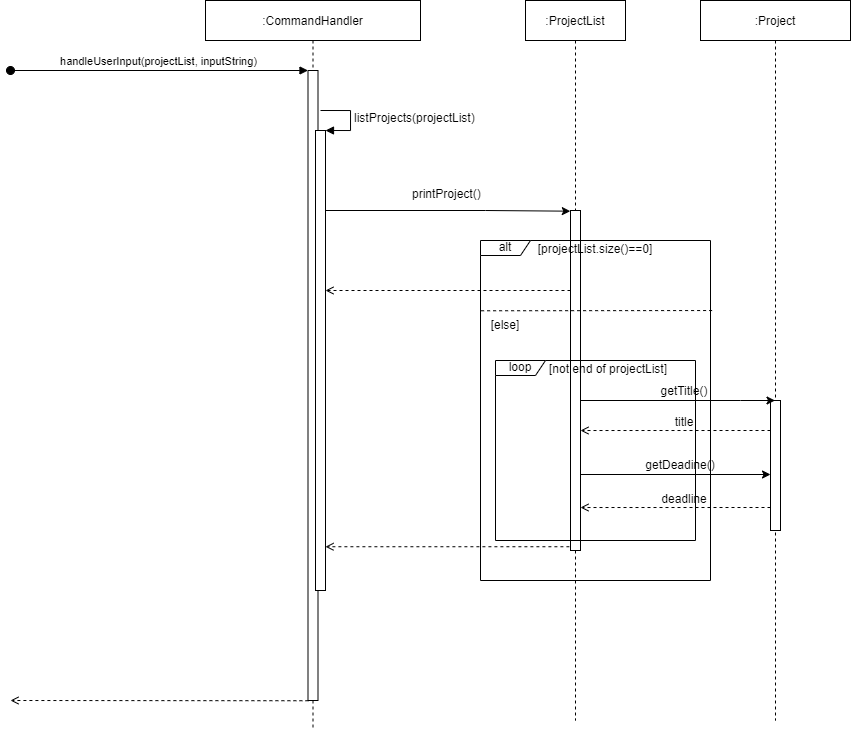

# Developer Guide

- [Acknowledgements](#acknowledgements)  
- [Design & Implementation](#design-&-implementation)  
  - [Architecture](#architecture)
  - [Implemented Features](#implemented-features)
  - [Proposed Features](#proposed-features)
- [Product scope](#product-scope)
- [User Stories](#user-stories)
- [Glossary](#glossary)
- [Instructions for manual testing](#instructions-for-manual-testing)


## Acknowledgements

The design of Developer Guide is referenced from the [AB-3 Developer Guide](http://se-education.org/addressbook-level3/DeveloperGuide.html).


## Design & Implementation
### Architecture
#### Main components of the architecture
  

**Main** contains the main class called `CsProjPlanner`. It is responsible for:
* At app launch: invokes methods to initialize the app, and gets prepared for receiving user input.
* At shut down: invokes methods to store generated data.

**UI** contains two classes `Constants` and `Response`. It is responsible for:
* Store messages which will be displayed frequently.
* Store magic numbers.
* Handles the responses to give to user.  

**Logic Component**  
.png)
How the `Logic` component works:
* When `CommandHandler` is called upon to execute a command, it creates `XYZCommandParser` object(e.g.,`AddProjectCommandParser`) which parses the user command and create a `XYZCommand` object (e.g., `AddProjectCommand`).
* The created `XYZCommand` object is returned as a `Command` object.
* All `XYZCommandParser` classes(e.g., `AddProjectCommandParser`, `AddTodoCommandParser`)inherit from the `Parser` interface.


**Model Component**


* The `Model` component stores all project data i.e., all `Project` objects in a list i.e.`ProjectList`.  
* Each project contains `Deadline` and `Todo` objects.  
* Does not depend on any of the other components (as the `Model` represents data entities of the domain, they should make sense on their own without depending on other components)


**Storage** contains class `Storage`. It is responsible for:
* Save project data in txt format, and read them back into corresponding objects.
* Dependent on some classes in the `Model` component.


### Implemented Features

Following a restucture to the project to follow a more Object Oriented structure, as well as to allow for conformity and easy editing of code, many of our commands will follow a similar structure of the following:

1. User enters a command, which is given to a Command Handler
2. The handler passes this to a corresponding Parser object for that command, which will split it into its necessary parts
3. The Parser will create a corresponding Command object for that command, which will perform its necessary actions
4. The Command object will return successfully to the Command Handler, and the output will be given to the user

The basic flow of the structure:



**Step 1.** The user inputs command. The command is retrieved by `handleUserInput()` in `CommandHandler`.

**Step 2.** `handleUserInput()` will check command type and create a new `CommandParser` object and call `parse()` in `CommandParser`.

**Step 3.** `CommandParser` will check if the input can be parsed into a valid command. If it fails, it will throw exceptions. After parsing the user’s input, `CommandParser` will create a new `Command` object and return it back to `CommandHandler`.

**Step 4.** `CommandHandler` will call `executeCommand()` in its own class to execute the returned command.

The command to add a project is one example of this structure:

#### Add a Project


**Step1.** After recieving the necessary method call, the `CommandHandler` class will self-call executeCommand with both the list of projects as well as a constructor call to AddProjectCommandParser (and a call to the parse method of AddProjectCommandParser) as its parameters

**Step2.** The AddProjectCommandParser object instance is created

**Step3.** The parse method of AddProjectCommandParser is called with `commands` (the user input) as its parameter.

**Step4.** AddProjectCommandParser will self call its `getProjectTitle` method. This will split the user's input and return the correct name for the project

**Step5.** After returning this projectTitle to itself, `AddProjectCommandParser` will call the constructor for a new `AddProjectCommand` object

**Step6.** This `AddProjectCommand` object will use the newly gathered project name to call the `addProjct` command of the `ProjectList` class.

**Step7.** The status of this command completing is returned to `CommandHandler`, and the output is sent to the user.

Deleting a project will follow nearly the exact same structure; the only difference is that the corresponding Parser and Command objects will be used (`DeleteProjectCommandParser` and `DeleteProjectCommand`)

#### Delete a Project

*The steps are omitted here as they are the exact same as adding a project, only with the differing class names previously mentioned.

#### Print Project List


**Step1.** When `CommandHandler` receives a user input starting with string "listproject" or "listprojects", it will call `listProjects`. This method ensure that `projectList` has been initialized before the next step.

**Step2.** Once the first step is done, `listProjects` will call the `printProject` method from `ProjectList` with no parameter.

**Step3.** `printList` will first check if the size of the private ArrayList named `projectList` is 0, which means that the arraylist is empty. If yes, it will print "You have not added any projects yet!" and return.

**Step4.** It will then iterate over `projectList`, which type is `Project`. It will call `getTitle` and `getDeadline` from each array element in`the `Project` class.

**Step5.** the general information of a project, i.e., its title and deadline, will be displayed.

#### Todo feature
.png)  

**Step1.** When `CommandHandler` receives a user input starting with string “todo”, it will create a `AddTodoCommandParser` object and call `parse()`function to parse the user input.  

**Step2.** The `AddTodoCommandParser` object will parse the todo input. Upon parsing the user input, it will create a `AddTodoCommand` and return it back to `CommandHandler`.  

**Step3.** After `CommandHandler` obtains the `AddTodoCommand` returned by `AddTodoCommandParser`, it then calls `executeCommand()` method in its own class.  

**Step4.** `executeCommand()` will call `execute()` method of `AddTodoCommand`. `AddTodoCommand` will call `addTodoToProject()` method in order to get the target project and add todo to it.

#### View a Project


The view function makes use of ```ProjectList``` and ```CommandHandler``` classes. It is facilitated by methods within the ```Todo``` and ```Project``` classes, stored within ```ProjectList```.
Given below is an example usage scenario and how View Project behaves at each step

**Step 1.** The user executes ```view cs2113``` to view the project titled cs2113. The command is retrieved and parsed by ```handleUserInput()``` in ```CommandHandler```, which calls ```view()``` in ```CommandHandler```

**Step 2.** The ```view()``` method ensures that ```ProjectList``` has been correctly initialised and the command is valid, before calling ```view()``` in ```ProjectList```

**Step 3.** ```view()``` in ```ProjectList``` calls ```findProjectIndex()``` in ```ProjectList```

**Step 4.** ```findProjectIndex()``` loops through all ```Project``` objects in projectList until a ```Project``` with the same title as the one entered by the user is found. The ```Project```’s index is returned to ```CommandHandler```'s implementation of ```view()```

**Step 5.** ```view()``` calls the ```printDetails()``` method of the ```Project``` at the given index

**Step 6.** ```printDetails()``` displays project title and deadline to the user. It iterates through the ```Todo```s in the ```todos``` attribute and prints each `Todo` by calling `Todo`’s `toString()` function


#### Add a Deadline to a Project


**Step 1.** When `CommandHandler` receives a user input starting with string “addprojdeadline”, it will create an `AddProjectDeadlineCommandParser` object and call its `parse()` function to parse the user input

**Step 2.** The `AddProjectDeadlineCommandParser` object will parse the todo input. Upon parsing the user input, it will create a `AddProjectDeadlineCommand` and return it back to `CommandHandler`.

**Step 3.** After `CommandHandler` obtains the `AddProjectDeadlineCommand` returned by `AddProjectDeadlineCommandParser`, it then calls `executeCommand()` method in its own class.

**Step 4.** `executeCommand()` will call `execute()` method of `AddProjectDeadlineCommand`.

**Step 5.** If the number of arguments is valid, call the projectList’s `addProjectDeadline()` method, with the arguments of title and deadline.

**Step 6.** We call the `findProjectIndex()` method to find the given project that matches the title provided. If the value indicates that the project does not exist, return immediately and indicate no deadline was added.

**Step 7.** If the index of the project was found, call that specific Project’s `setDeadline()` method and update the deadline.

**Step 8.** The string deadline is used to build the class object `Deadline`

**Step 9.** Inside the constructor it considers 2 types of inputs, a day of the week or a date format of yyyy-mm-dd. If it is a day of the week, it will properly detail next day that day of the week from the current day.


#### Add a Deadline to a Todo


**Step 1.** When `CommandHandler` receives a user input starting with string “addtododeadline”, it will create an `AddTodoDeadlineCommandParser` object and call its `parse()` function to parse the user input

**Step 2.** The `AddProjectDeadlineCommandParser` object will parse the todo input. Upon parsing the user input, it will create a `AddTodoDeadlineCommand` and return it back to `CommandHandler`.

**Step 3.** After `CommandHandler` obtains the `AddTodoDeadlineCommand` returned by `AddTodoDeadlineCommandParser`, it then calls `executeCommand()` method in its own class.

**Step 4.** `executeCommand()` will call `execute()` method of `AddTodoDeadlineCommand`.

**Step 5.** If the number of arguments is valid, call the projectList’s `addTodoDeadline()` method, with the arguments of indexProj, indexTodo, and deadline.

**Step 6.** Using the indexProj, we find the index of the project we are looking for and call its `addTodoDeadline()` method, with the arguments indexTodo and deadline.

**Step 7.** Using the index of the todo, we call that specific Todo’s `setDeadline()` method and update the deadline.

**Step 8.** The string deadline is used to build the class object `Deadline`

**Step 9.** Inside the constructor it considers 2 types of inputs, a day of the week or a date format of yyyy-mm-dd. If it is a day of the week, it will properly detail next day that day of the week from the current day.


### Proposed Features

 


#### Tasks Due Soon Feature
The Tasks Due Soon feature makes use of `ProjectList` and `CommandHandler` classes. It is facilitated by methods within the `Todo` and `Project` classes, stored within `ProjectList`.

**Step 1.** The user executes `duesoon`. The command is retrieved and parsed by `handleUserInput()` in `CommandHandler`, which executes a self-call to `duesoon()`

**Step 2.** `duesoon()` ensures that `ProjectList` has been correctly initialised before calling `printDueSoon()` in `ProjectList`

**Step 3.** `printDueSoon()` in `ProjectList` initialises `tasksDue` as an empty list of `Todo`s

**Step 4.** The method iterates through all `Project`s in `projectList`. For each `Project`, it then iterates through all `Todo`s in the `todos` attribute. The task deadline of each `Todo` is retrieved and compared against the current time. If the deadline is within the next 24 hours, the `Todo` is added to `tasksDue`

**Step 5.** `printDueSoon()` then calls `printTodos()` in `ProjectList` and passes in `tasksDue`.

**Step 6.** `printTodos()` iterates through all `Todo`s in `tasksDue` and prints each of them using `Todo`’s `toString()` method.


### Previous project structure
During v2.0, CSProjPlanner underwent a structure change to make it more OOP oriented and to make commands function in a way that are much more similar to each other.

Because of this, many sequence diagrams look similar in the current version. The following sequence diagrams and explanations show what some of our features looked like at the end of v1.0:

#### Add a Project


**Step1.** When `CommandHandler` receives a user input starting with string "addproject", it will call `getProjectName`, which will return the project name. If the user did not provide at least 2 arguments, they will recieve a message and this command won't execute.

**Step2.** Once this project name is returned, `CommandHandler` will call the `addProject` method from `ProjectList` with the project Name as a parameter

**Step3.** `ProjectList` will self-call the `add` method, using a constructor to a new `Project` object as a parameter

**Step4.** This new `Project` object is returned to the ProjectList, added, and the output "[projectName] added." is given to the user.

#### Delete a Project


The previous deletion of a project functions very similarly to Adding a project.

**Step1.** When `CommandHandler` receives a user input starting with string "addproject", it will call `getProjectName`, which will return the project name. If the user did not provide at least 2 arguments, they will recieve a message and this command won't execute.

**Step2.** Once this project name is returned, `CommandHandler` will call the `deleteProject` method from `ProjectList` with the project Name as a parameter.

**Step3.** `ProjectList` will self-call the findProjectIndex method, which will take the project name as a parameter.

**Step4.** The findProjectIndex method will call `getTitle` with the project name as a parameter.

**Step5.** the `findProjectIndex` method is called on every Project in the ProjectList until it finds the correct one. If it doesn't, the user is given an according error message.

**Step6.** The index of the project is returned, and `ProjectList` will self-call the remove(index) method, removing the project from the planner.

## Product scope
### Target user profile

* computer science university students
* has a need to manage a significant number of projects and tasks
* can type fast
* prefers typing to mouse interactions
* is reasonably comfortable using CLI apps

### Value proposition

CSProjPlanner provides a project management and scheduling system geared toward Computer Science students and utilises a text UI interface. 
While providing CS students a convenient way to keep track and store all relevant information, links, and deadlines for their projects, 
the program also allows for faster searching and editing than a GUI design once the user is familiar with the commands—a concept CS students are far too familiar with.

## User Stories

| Version | As a ...                    | I want to ...                                             | So that I can ...                                                                 |
|---------|-----------------------------|-----------------------------------------------------------|-----------------------------------------------------------------------------------|
| v1.0    | new or experienced user     | add a task to the planner                                 | better organize my project                                                        |
| v1.0    | user with existing projects | delete a project from the planner                         | remove projects that are already completed                                        |
| v1.0    | user with existing projects | print all projects I have saved from the planner          | see what projects I have had so far                                               |
| v1.0    | user with existing projects | add a to-do to a project                                  | get a clear outline of what needs to be done                                      |
| v1.0    | student user                | add  a deadline for my project                            | keep track of due dates                                                           | 
| v1.0    | student user                | view the details (to-do list and deadlines) of my project | see what needs to be done and when to do it                                       |
| v1.0    | student user                | mark a to-do as done                                      | keep track of already completed tasks                                             |
| v1.0    | student user                | mark a to-do as not done                                  | fix mistakes of marking unfinished tasks                                          |
| v1.0    | new user                    | access a help command                                     | familiarize myself with using the planner                                         |
| v1.0    | student user                | exit the application                                      | close my planner when I am finished                                               |
| ------  | --------------------------- | --------------------------------------------------------- | --------------------------------------------------------------------------------- |
| v2.0    | student user                | have quick access to my project's Github repo             | best keep track of my project lifecycle                                           |
| v2.0    | student user                | list the programming languages/frameworks my project uses | know what languages/frameworks focus on and study                                 |
| v2.0    | student user                | add a deadline to a to-do                                 | know the deadlines for each individual to-do                                      |
| v2.0    | student user                | save my project information in a file                     | keep a backup and also save my projects/schedules for the next time I use the app |

## Non-Functional Requirements

1. Should work on any mainstream OS as long as it has Java 11 or above installed.
2. user with above average typing speed for regular English text (i.e. not code, not system admin commands) should be able to accomplish most of the tasks faster using commands than using the mouse.


## Glossary

* *Mainstream OS* - Windows, MacOS and Linux (Ubuntu) are all able to run CS ProjPlanner
* *Project* - Within CS ProjPlanner, a project is embarked on by Computer Science students for their university classes. As such, on top of typical project elements like titles, deadlines and tasks, projects include programming languages and GitHub repository links.
* *Todo* - Within each project is a list of (optional to add) todo's. These represent tasks to be done on the project

## Instructions for manual testing

{Give instructions on how to do a manual product testing e.g., how to load sample data to be used for testing}
